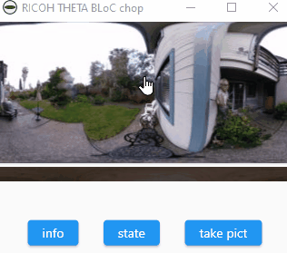
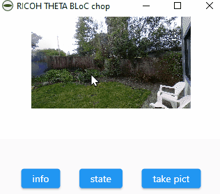

# RICOH THETA BLoC and chopper example

Use cubits to manage state and chopper to get data from a RICOH THETA
camera.



Navigation with panorama.



## YouTube Tutorials

* [Flutter BLoC Introduction with Cubit - Simple and Basic Tutorial](https://youtu.be/mSXKvWjojpo)
* [Beginner Flutter BLoC Network API Setup](https://youtu.be/2MHyrcyfIbs)

## Development Resources

* [RICOH THETA API Reference](https://api.ricoh/docs/theta-web-api-v2.1/) - if you have a RICOH THETA camera.  There is no emulator.  You need a real camera.
* [Lorem Picsum](https://picsum.photos/) - free image API server with similar API architecture to RICOH THETA. available to everyone.
* [JSONPlaceholder](https://jsonplaceholder.typicode.com/) - free text only API server

## Development Tips

To generate the service code:

```text
flutter pub run build_runner build
```
