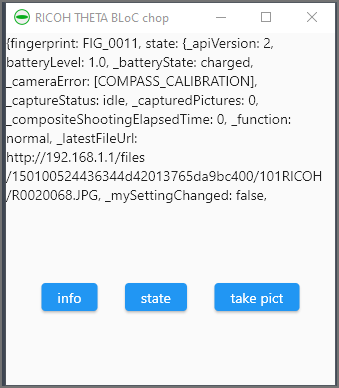

# BLoC and chopper example

Using cubits to manage state and chopper to get data from a RICOH THETA
camera.



## Development Tips

To generate the service code:

```text
flutter pub run build_runner build
```